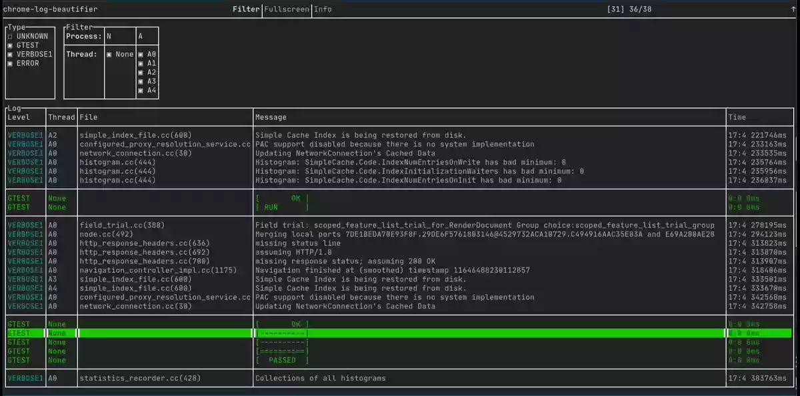

# chrome-log-beautifier

Make Chrome logs fancy.



## Features:
  - Streaming supported. E.g.  ``` chrome 2>&1 | chrome-log-beautifier```
  - Colorization.
  - Filter by:
    - Process & Thread
    - Log level

#### Potential improvements:
  - Save logs as txt / json
  - Support StackTraces. Find a way to smartly attribute the trace to its emitting thread.
  - Find the process type (browser, renderer, GPU). Is this possible?

## Usage
```bash
chrome-log-beautifier logfile
```
Or you can even stream the logs:
```bash
chrome --v=2 2>&1 | chrome-log-beautifier
```

## Installation:
Install build tools:
```
  sudo apt install git cmake build-essential
```

Build & install chrome-log-beautifier
```bash
  git clone https://github.com/ArthurSonzogni/chrome-log-beautifier
  cd chrome-log-beautifier
  mkdir build
  cd build
  cmake ..
  make -j
  sudo make install
```
